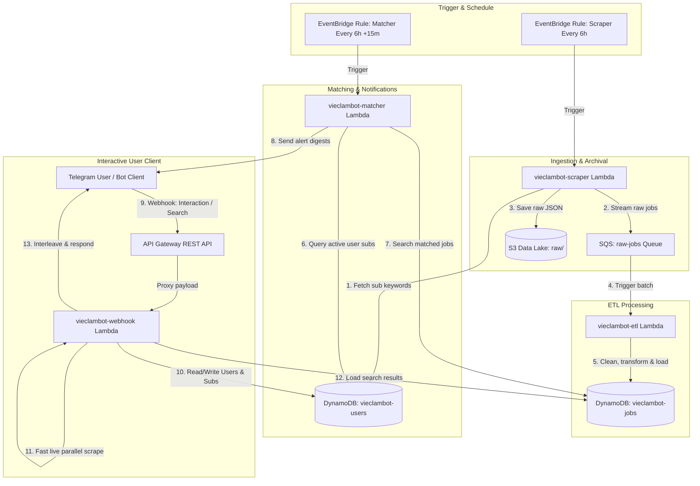
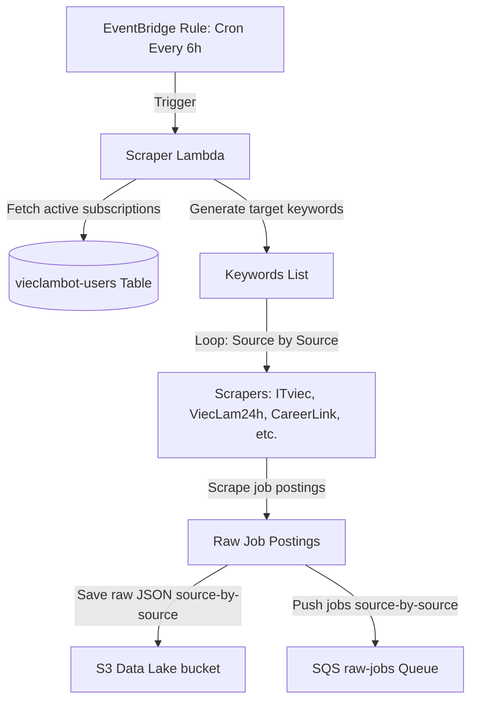
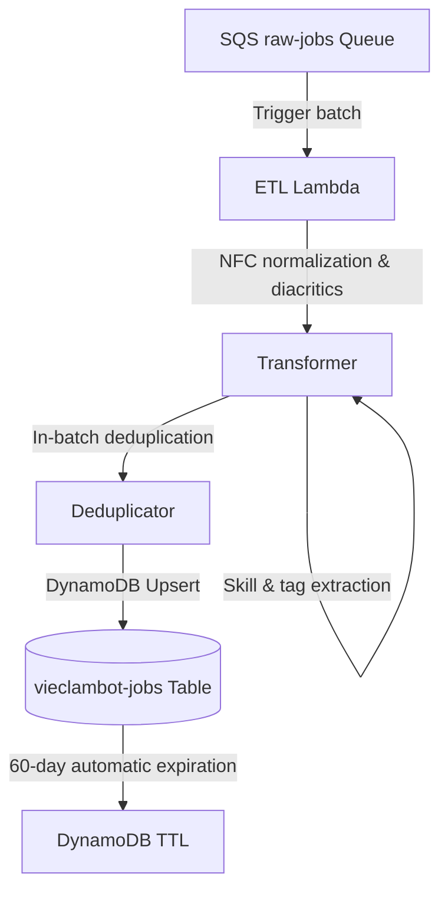
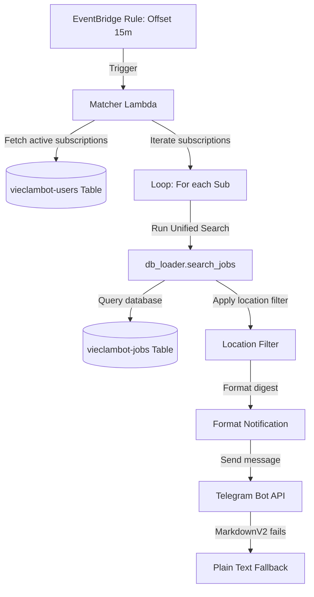
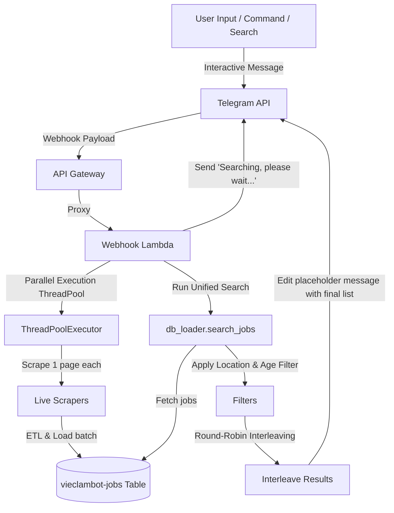

# ViecLamBot - Serverless Vietnamese Job Aggregator and Telegram Alert System

Live Telegram Bot: [https://t.me/cty_khong_bot](https://t.me/cty_khong_bot)

**ViecLamBot** is a serverless Vietnamese job aggregator and notification system designed to crawl, process, filter, and deliver job opportunities in Vietnam directly to users via Telegram. It supports parallel search, Vietnamese spelling tolerance, source interleaving, location-aware filtering, and resilient serverless workflows on AWS.

---

## System Workflows & Architecture

The system is deployed on AWS using a serverless architecture consisting of four main pipelines.

### End-to-End System Flowchart
Below is the system-wide lifecycle of jobs, subscriptions, and interactions:



### 1. Scraper Pipeline (Every 6 Hours)
Triggered periodically by an EventBridge scheduled rule. It runs scrapers in a memory-efficient stream-like fashion to prevent execution spikes.
* **Process**: Computes search keywords from active user subscriptions and seed keywords, crawls job boards, and pushes results **source-by-source** to SQS and S3 immediately rather than waiting for the entire run to complete.



### 2. ETL & Ingestion Pipeline (Event-Driven)
Triggered automatically by messages arriving in the SQS queue.
* **Process**: Cleans, parses, maps, and normalizes job listings, then bulk-inserts them into DynamoDB.
* **Idempotent Ingestion**: Removed pre-database check steps to simplify the code and leverage DynamoDB's native upsert behavior (update/overwrite existing items while updating the `scraped_at` timestamp).



### 3. Matcher & Notification Pipeline (Every 6 Hours)
Triggered 15 minutes after the Scraper pipeline starts to ensure all ETL messages are processed.
* **Process**: Matches the active user subscriptions against jobs in the database.
* **Unified Query Logic**: Uses the exact same database search and spelling tolerance logic as the interactive `/search` command to guarantee total consistency between subscriptions and manual searches.



### 4. Interactive Bot Webhook & Live Search (Real-time)
Triggered instantly when a user interacts with the bot on Telegram.
* **Process**: Handles commands and live queries. For searches, it displays a loading message, executes a live fast parallel crawl across all sources (1 page each), ingests results on-the-fly, queries all matched items from the database, filters results, interleaves them, and updates the chat.



---

## Directory Structure

```text
Project DE/
├── .env                  - Local environment configurations
├── requirements.txt      - Python dependencies
├── pyproject.toml        - Test configuration metadata
├── dist/                 - Build target directory for Lambda deployment packages
├── lambdas/              - Entry points for AWS Lambda handlers
│   ├── scraper_handler.py    - Starts scraper pipeline (pushes to SQS and S3 in source batches)
│   ├── etl_handler.py        - Listens to SQS, runs ETL, and upserts jobs in DynamoDB
│   ├── matcher_handler.py    - Matches active user subscriptions using unified search logic
│   └── bot_webhook_handler.py- Entry point for API Gateway Telegram webhook payloads
├── scripts/              - Local helper, testing, and deployment scripts
│   ├── local_bot_polling.py  - Runs Telegram bot locally using long polling
│   ├── local_pipeline_run.py - Runs the scraper & ETL pipeline locally
│   ├── setup_aws_resources.py- Provisions DynamoDB tables, SQS, S3, and roles
│   ├── deploy_lambdas.py     - Packages and deploys code to AWS Lambda (custom timeouts configured)
│   ├── fetch_lambda_logs.py  - Fetches recent Lambda logs directly from CloudWatch
│   └── test_scrapers_live.py - Test scrapers on a single search keyword locally
└── src/                  - Core application logic
    ├── bot/
    │   └── handler.py        - Telegram Bot commands, interactive routing, and Markdown fallback
    ├── common/
    │   ├── aws_clients.py    - Cached boto3 client initializers
    │   ├── logger.py         - JSON format logging configurations
    │   └── models.py         - Pydantic models (Job, RawJob, User, Subscription)
    ├── config.py             - Central configuration settings (Pydantic Settings)
    ├── data_quality/
    │   └── validators.py     - Schema validator and quality filters for crawled raw data
    ├── etl/
    │   ├── loader.py         - DynamoDB loaders, bulk loaders, and unified search logic
    │   └── transformer.py    - Unicode normalizer, location standardization, and tags parser
    ├── matcher/
    │   └── keyword_matcher.py- Matches jobs to users and formats notifications
    └── scrapers/
        ├── base_scraper.py   - Base abstract scraper with rate limits and retries
        ├── careerlink_scraper.py
        ├── careerviet_scraper.py
        ├── itviec_scraper.py
        ├── jooble_scraper.py
        ├── timviec365_scraper.py
        ├── vieclam24h_scraper.py (handles mywork & timviecnhanh redirects)
        └── ybox_scraper.py       - Extracted by parsing script tags and local keyword filtering
```

---

## Supported Job Sources

The system aggregates job openings from seven major platforms:

* **CareerLink.vn**: Parsed from Next.js server-rendered HTML.
* **ViecLam24h.vn**: Crawled from Tailwind CSS-based dynamic structure (also absorbs redirects from **MyWork** and **TimViecNanh**).
* **ITviec.com**: Scrapes technology-specific jobs.
* **CareerViet.vn**: (Formerly CareerBuilder Vietnam) Parsed from server-side rendered HTML.
* **TimViec365.vn**: Parsed from static HTML using card selectors.
* **Jooble API**: Queries the Jooble developer API (used if an API key is configured).
* **YBox.vn**: Highly popular portal for internships, part-time, and entry-level positions in Vietnam. Extracted by parsing embedded JSON data inside server-rendered script tags and filtered locally for maximum efficiency.

---

## Database Design (DynamoDB Single-Table Schema)

A single-table design is used for users and subscriptions, while job postings are stored in a separate table for cleaner TTL lifecycle management.

### 1. Users and Subscriptions (`vieclambot-users`)
* **Partition Key (PK)**: `user_id` (Telegram Chat ID, e.g., `1613425467`)
* **Sort Key (SK)**:
  * For user profiles: `USER`
  * For subscriptions: `SUB#<normalized_keyword>` (e.g., `SUB#data engineer`)
* **Attributes**:
  * User: `username`, `first_name`, `registered_at`, `is_active`
  * Subscription: `keyword_raw`, `keyword_normalized`, `location_filter`, `subscribed_at`, `is_active`

### 2. Jobs Table (`vieclambot-jobs`)
* **Partition Key (PK)**: `job_id` (SHA-256 hash of the canonical URL)
* **Attributes**: `title`, `title_normalized`, `company`, `location`, `location_normalized`, `salary_raw`, `salary_min`, `salary_max`, `description`, `source`, `source_url`, `tags`, `posted_at`, `scraped_at`, `ttl` (Unix timestamp for 60-day automatic expiration).

---

## Data Engineering Principles & Key Improvements

### 1. Stream Ingestion with SQS & S3 Source-Partitioning
* **Streaming Architecture**: Rather than gathering all scraped jobs in memory and sending them at the end, the Scraper Lambda processes each source separately, immediately uploading its raw JSON to S3 and streaming valid records to SQS. This reduces execution memory usage and avoids scraping failures during long runs.
* **Source Partitioning**: Raw data is saved in S3 with partition layouts based on source name: `s3://<bucket>/raw/{source_name}/YYYY/MM/DD/raw_YYYYMMDD_HHMMSS.json`. This provides auditability and allows targeted backfilling for specific job boards.

### 2. Idempotent Ingestion & Database Overwriting
* **DynamoDB Upsert**: We removed the pre-database deduplication step that checked existing job IDs. The ETL Lambda directly bulk-upserts into DynamoDB. When a job is re-scraped, DynamoDB updates the record and refreshes the `scraped_at` timestamp. This simplifies code, reduces DynamoDB read operations, and ensures active alerts pick up refreshed job posts.

### 3. Multi-Stage Validation Gates
* **Raw Validator**: Checks critical scraping output parameters (title, URL) and computes completeness metrics.
* **Processed Validator**: Executes sanity checks before DynamoDB writing (validating salary ranges, location parameters, and primary keys).

### 4. Advanced Matching & Interleaving Algorithms
* **Unified Search Logic**: The Matcher Lambda now queries subscriptions directly using `db_loader.search_jobs()`, utilizing the identical search algorithms as the user `/search` command.
* **Vietnamese Accent & spelling Tolerance**: Strips Vietnamese diacritics, maps accents uniformly, converts the text to NFC format, and normalizes "i" and "y" vowels (e.g., "kỹ" and "kĩ" match the same) to ensure searches succeed without precise typing.
* **Round-Robin Interleaving & Age Filtering**:
  * Limits results to listings posted in the last **7 days** (with a fallback to older jobs if none are found).
  * Sorts matches chronologically within each job board, then builds the final list by taking one job from each board in rotation. This prevents any single website from dominating the results.

---

## Configuration Settings

The system loads configurations from environment variables prefixed with `VIECLAMBOT_`.

Key variables configured in `.env` include:
* `VIECLAMBOT_TELEGRAM_BOT_TOKEN`: The API token from BotFather.
* `VIECLAMBOT_AWS_REGION`: Target AWS region (default: `ap-southeast-1`).
* `VIECLAMBOT_DYNAMODB_JOBS_TABLE`: Name of the DynamoDB jobs table.
* `VIECLAMBOT_DYNAMODB_USERS_TABLE`: Name of the DynamoDB users table.
* `VIECLAMBOT_S3_DATA_LAKE_BUCKET`: S3 bucket name for raw scraping backups.
* `VIECLAMBOT_SQS_RAW_JOBS_QUEUE`: SQS queue name for raw scraped postings.
* `VIECLAMBOT_JOOBLE_API_KEY`: API key for Jooble API scraper.
* `VIECLAMBOT_LOG_LEVEL`: Log levels (`INFO`, `DEBUG`).

---

## Telegram Bot Commands

* `/start`: Registers user profiles and shows the welcome message.
* `/subscribe <keyword> [| location]`: Subscribes to alerts.
  * _Example:_ `/subscribe data analyst | hồ chí minh`
  * _Example:_ `/subscribe Python | Hà Nội`
  * Maximum 3 active subscriptions.
* `/unsubscribe <keyword>`: Unsubscribes from a keyword.
  * Running `/unsubscribe` without keywords displays all active subscriptions with clickable, pre-filled unsubscribe commands.
  * Matches the keyword loosely (substring matching). Removes matches and lists what was deleted.
* `/list`: Lists active subscription keywords.
* `/myjobs` or `/jobs`: Displays the top 20 latest jobs matching the user's subscriptions, filtered by age and interleaved across sources.
* `/search <keyword> [| location]`: Triggers a live parallel search (crawls 1 page from each source in real-time), saves results, and displays the top 20 interleaved matches.
  * **Status Message**: Immediately sends a `"🔍 Đang tìm kiếm việc làm trực tiếp từ các nguồn, vui lòng đợi trong giây lát..."` placeholder that edits itself to show the final results when finished.
* `/help`: Detailed help manual.
* **Direct Text Input**: Non-command messages automatically trigger `/search`.
* **MarkdownV2 Fallback**: If sending text in MarkdownV2 style fails (due to escaping issues), the bot automatically strips MarkdownV2 escape characters and sends plain text to guarantee delivery.

---

## Local Development and Debugging

### Setup
Create a `.env` file in the project root:
```env
VIECLAMBOT_TELEGRAM_BOT_TOKEN=your_token_here
VIECLAMBOT_AWS_REGION=ap-southeast-1
VIECLAMBOT_DYNAMODB_JOBS_TABLE=vieclambot-jobs
VIECLAMBOT_DYNAMODB_USERS_TABLE=vieclambot-users
VIECLAMBOT_S3_DATA_LAKE_BUCKET=your_s3_bucket
VIECLAMBOT_SQS_RAW_JOBS_QUEUE=your_sqs_queue
VIECLAMBOT_JOOBLE_API_KEY=your_jooble_key_here
```

### Running Tests
Execute the unit test suite:
```bash
set PYTHONUTF8=1
py -m pytest
```

### Running Scrapers & Pipelines Locally
```bash
# Test scrapers locally for a target keyword
set PYTHONUTF8=1
py scripts/test_scrapers_live.py

# Run a complete Scrape -> SQS -> ETL loop locally on your machine
set PYTHONUTF8=1
py scripts/local_pipeline_run.py
```

### Running the Bot Locally (Long Polling)
Temporarily bypasses the live AWS Lambda webhook and reads updates directly from Telegram:
```bash
set PYTHONUTF8=1
py scripts/local_bot_polling.py
```

---

## AWS Deployment

### 1. Provision Infrastructure
Create DynamoDB tables, SQS queues, S3 buckets, and execution IAM roles:
```bash
py scripts/setup_aws_resources.py
```

### 2. Deploy Lambda Functions
Packages requirements, bundles code, updates Lambdas on AWS, and updates the Telegram webhook URL to point to API Gateway:
```bash
py scripts/deploy_lambdas.py
```
* **Timeout Configurations**: The scraper Lambda is configured with a timeout of **900s (15 minutes)** to allow thorough scraping. The matcher Lambda has a timeout of **120s**.

### 3. Monitor & Fetch Logs
Fetch recent logs (last 15 minutes) for the bot webhook Lambda directly to the console:
```bash
py scripts/fetch_lambda_logs.py
```
